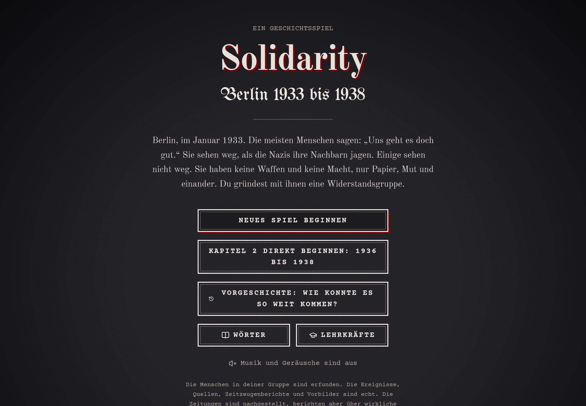
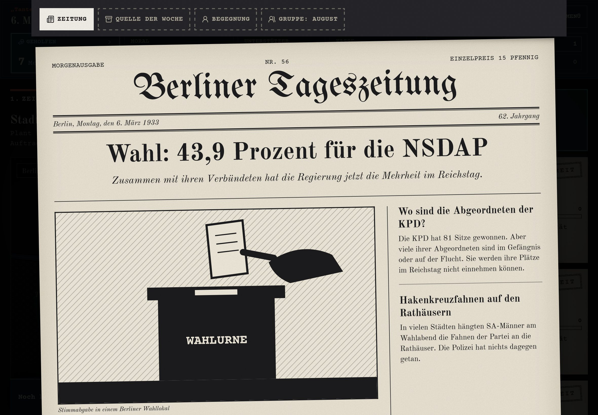
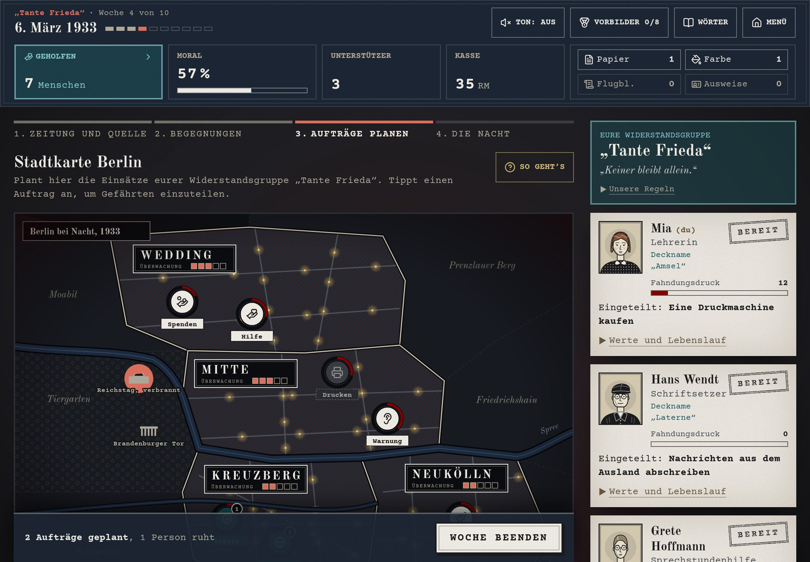
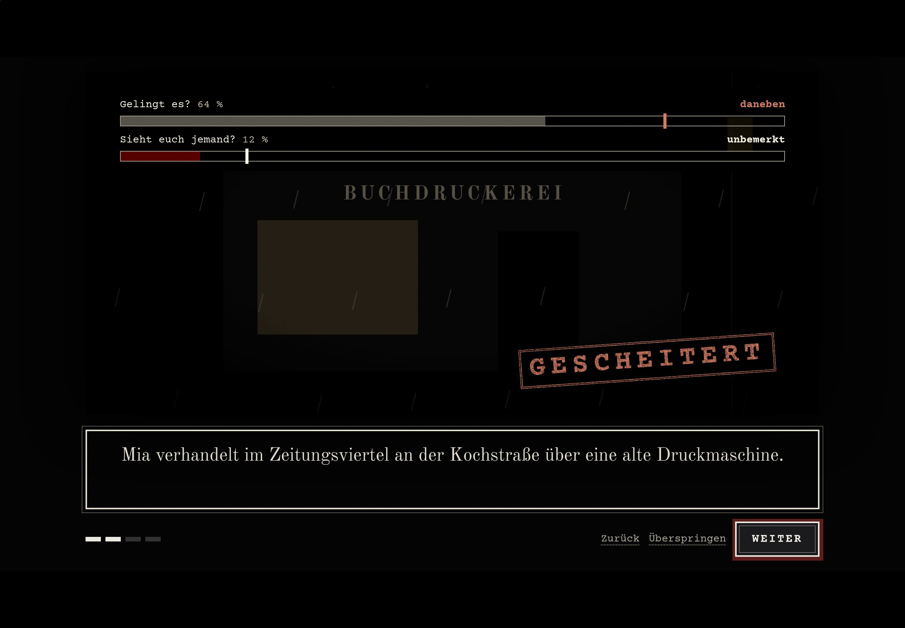
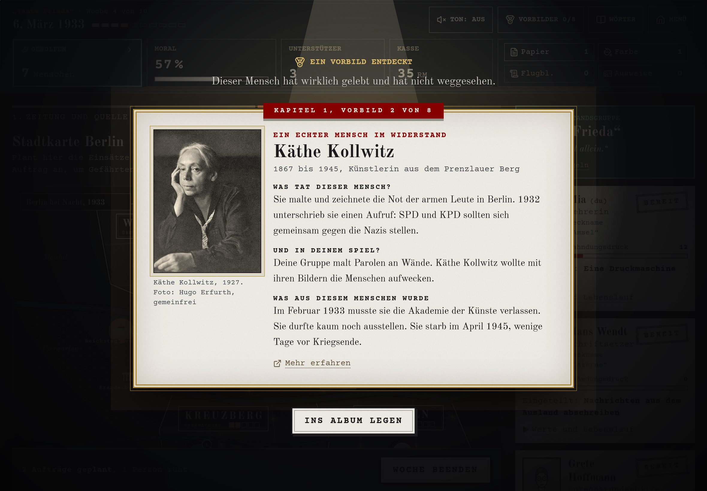

# Solidarity

Welcome to **Solidarity**, a history game for the classroom in which students
**lead a small resistance group through Berlin between 1933 and 1938** and
decide, week by week, whether to look away or to help.

The idea: most people in 1933 said "we're doing fine" and looked away while
their neighbours were persecuted. The group in this game is made up of people
who are **not persecuted themselves** and stand up for those who are. The score
is not a victory over fascism, it is **solidarity**: how many people the group
stood by.

This started at the kitchen table. My partner teaches social studies and wanted
a game her classes could play on the school iPads, one chapter per double
lesson. I built it with her, so it is shaped by **feedback from the classroom
side** from the start, and her teaching team is the next round of testers.

> Built with an AI pair-programming workflow (Claude Code). I drove the
> architecture, the game design and the historical research, and can walk
> through every decision.

## Table of Contents

- [Short Description](#short-description)
- [Showcase](#showcase)
- [Key Features](#key-features)
- [How It Works](#how-it-works)
- [Technologies Used](#technologies-used)
- [What's Real & What's Fictional](#whats-real--whats-fictional)
- [Challenges & Lessons Learned](#challenges--lessons-learned)
- [How to Get Started (Local Setup)](#how-to-get-started-local-setup)
- [Live Demo](#live-demo)
- [Notes](#notes)

## Short Description

Solidarity is a browser game in two chapters: ten weeks from January to May
1933, and eight weeks from March 1936 to November 1938, including the
November pogroms. Every
week follows the same loop: a newsreel, the newspaper, a historical source,
an encounter with a decision, then planning missions on a map of Berlin, and a
night in which the missions play out as short animated scenes.

It runs in **two levels** (grades 6 to 8, and grade 9 up to sixth form). Every
text in the game exists twice: in plain language with short sentences, and in a
fuller version with original quotes. The events are the same in both levels;
the harder level only changes how dangerous it is for the group.

Scope is deliberately small: no accounts, no server, no tracking. It is a
static site that runs on any web server and keeps the save game on the device.

## Showcase

### Screenshots

<p align="center">
  
</p>
<p align="center">
  
</p>
<p align="center">
  
</p>
<p align="center">
  
</p>
<p align="center">
  
</p>

## Key Features

- **Two levels, one history.** Every text is written twice (`L('easy', 'hard')`)
  and resolved at runtime. Tests enforce the language rules, such as a maximum
  average sentence length for the easier level.
- **A week as a ritual:** newsreel, newspaper, a real historical source with a
  question, an encounter with a decision, then the map. Students can always page
  back, decisions stay made.
- **Missions on a map of Berlin** with districts, surveillance levels and a
  team of three companions chosen from nine, each with their own strengths,
  backstory and personal stories.
- **Transparent chance.** At night, two gauges sweep and stop: "Does it work?"
  and "Does anyone see you?". Students see the odds and the roll, nothing is
  hidden.
- **Faces instead of numbers.** Everyone the group helps gets a name and a
  portrait on a wall; some of them write letters weeks later.
- **13 real role models** (8 in chapter 1, 5 in chapter 2), from Käthe Kollwitz
  to Wilhelm Krützfeld, each with a period photo, sources and their fate.
  Anyone not met during play is introduced at the end of the chapter.
- **Consequences without despair.** Arrests are shown as their own scene. In the
  easier level people come back after one or two weeks; in the harder level some
  do not, and the group can be broken up, followed by a chronicle of what
  happened next.
- **Made for school iPads:** large tap targets, portrait, landscape and split
  screen, sound off by default, a QR code for the class, and a printable
  summary sheet at the end.
- **Notes for teachers** with a week-by-week content overview, sensitive topics,
  the didactic approach and image credits.

## How It Works

```
Data (TypeScript)                     Store (Zustand, persisted)           UI (React)
┌──────────────────────────┐          ┌───────────────────────────┐        ┌──────────────────────┐
│ weeks, sources, stories  │          │ beginWeek()               │        │ Newsreel (Cinema)    │
│ missions, role models    │──L()────▶│   events, missions, goal  │───────▶│ Newspaper, Source    │
│ every text: easy + hard  │ resolve  │ endWeek()                 │        │ Encounter            │
└──────────────────────────┘          │   roll, arrests, helped   │        │ Map + mission dossier│
                                      │ nextWeek()                │        │ Night (roll gauges)  │
                                      │   prison, letters, end    │        │ Week report          │
                                      └─────────────┬─────────────┘        └──────────────────────┘
                                                    │
                                              localStorage (this device only)
```

All game logic lives in pure functions in `src/game/logic.ts` and the store, so
it can be simulated without a browser. The mission roll, simplified:

```
success = clamp(45 + levelBonus + (teamPower - difficulty) × 9,  5, 95)
risk    = clamp((baseRisk + surveillance × 0.6 + (teamSize - 1) × 8
                 - bestStealth × 3 + avgHeat × 0.2 - trust × 2) × levelFactor,  3, 90)

arrested only if seen, and more likely if the person is already wanted;
whoever reaches 100 heat is picked up at home the next morning
```

Team power uses diminishing weights, so sending everyone is rarely worth it: a
bigger team is a little stronger but much easier to spot.

## Technologies Used

- **Frontend:** React 19, TypeScript, Vite, Tailwind CSS 4
- **State:** Zustand with `persist` (versioned save game in `localStorage`)
- **Audio:** Web Audio API, short sound effects synthesised in the browser,
  music as recordings with gapless loops and crossfades
- **Testing:** Vitest (game logic, texts, balance), Playwright with **WebKit**
  on simulated iPads (end to end)
- **Assets:** self-hosted fonts (Fontsource), period photos from Wikimedia
  Commons / Bundesarchiv, illustrations as inline SVG
- **Hosting:** any static host, currently Vercel

## What's Real & What's Fictional

| Part                                   | Status                                                                                      |
| -------------------------------------- | ------------------------------------------------------------------------------------------- |
| Events, dates, places                  | **Real.** Researched and fact-checked, corrected after a review round                        |
| Sources of the week, eyewitness quotes | **Real**, with references (for example Luise Solmitz, Klaus Mann, Erich Kästner)            |
| Role models and their photos           | **Real people**, photos with full credits (mostly Bundesarchiv, CC BY-SA 3.0 de)             |
| Newspapers                             | **Reconstructed.** Real events, written in the tone of the press at the time                |
| The group and its companions           | **Fictional**, but their fates follow what happened to many people in their situation        |
| Diary notes and voices from the street | **Fictional** and labelled as such in the game                                               |
| Odds and rolls                         | **Game mechanics.** Tuned by simulation, not a historical model                              |

## Challenges & Lessons Learned

- **Writing for two audiences at once.** Every text exists in two levels, so
  language became data. Treating texts like code (typed, tested for sentence
  length, forbidden characters and leftover placeholders) kept hundreds of
  paragraphs consistent.
- **Balancing with simulations.** The harder level felt unfair in a test round,
  so I simulated hundreds of games with a careful and a "bold first-timer"
  strategy. Bold players finished chapter 1 in only about 45 % of games, mostly
  because the group's morale collapsed. After retuning they finish in about
  93 %, and a test now guards that number. Arrests are still as frequent: the
  seriousness lies in the losses, not in an early game over.
- **iPad Safari is its own platform.** Running the end-to-end tests in WebKit
  found real bugs: a double tap could skip a whole week, a fast tap during an
  auto-advancing scene led to a black screen, audio stopped after the lock
  screen, and a dialog inside an animated element anchored itself to that
  element instead of the screen (a `transform` creates a containing block for
  `position: fixed`; the fix was rendering dialogs through a portal).
- **Historical accuracy is a feature.** A review from four perspectives (game
  dev, designer, historian, teacher) caught factual errors before students did,
  for example on the 1936 ballot design and on when the forced name "Sara" was
  introduced. Every new fact gets checked against sources.
- **Playtesting beats my own ideas.** Short test rounds changed the game more
  than any plan: a "read more" button in the newspaper went out ("a real
  newspaper doesn't have buttons"), free-text mottos became a fixed choice after
  a teacher pointed out what students would type, and role models were split
  per chapter so that a class playing only one double lesson can still meet all
  of them.
- **Small details, real complexity.** If a student shares a first name with a
  companion, the companion gets another first name, and all their stories
  switch to it, including German genitive forms ("Lottes" becomes "Liesels").

## How to Get Started (Local Setup)

Prerequisites: Node 20+.

```bash
npm install
npm run dev                   # http://localhost:5173
```

Run the checks:

```bash
npm run typecheck
npm test                      # game logic, texts, balance (74 tests)
npx playwright install webkit # once
npm run test:ipad             # plays both chapters on simulated iPads
```

The iPad test builds the game and plays it like a child would, in portrait,
landscape, iPad mini and split screen. It fails on crashes, console errors,
images that don't load, pages wider than the screen, and save games that don't
survive a reload.

Build for the classroom:

```bash
npm run build                 # static site in dist/
```

`dist/` runs on any web server, also in a subfolder (for example on a school
server).

## Live Demo

[Solidarity on Vercel](https://solidarity-game.vercel.app/) &nbsp;·&nbsp; _(static site on Vercel, no
login; the game is in German, the target audience)_

## Notes

- **German UI.** The game is written for German classrooms; this README is in
  English for my portfolio.
- **Sound is off by default.** Classrooms are loud enough. Music only plays
  after it is switched on.
- **Music rights.** The folk song "Die Gedanken sind frei" is in the public
  domain; the piano recording on the title screen belongs to its pianist, and
  permission for its use in this project has been requested. The in-game
  background track is a placeholder.
- **Save game on the device.** Safari deletes site data after seven days
  without a visit, so a chapter should not be spread over more than a week.
- Built as part of my journey from frontend into full-stack; feedback always
  welcome.
